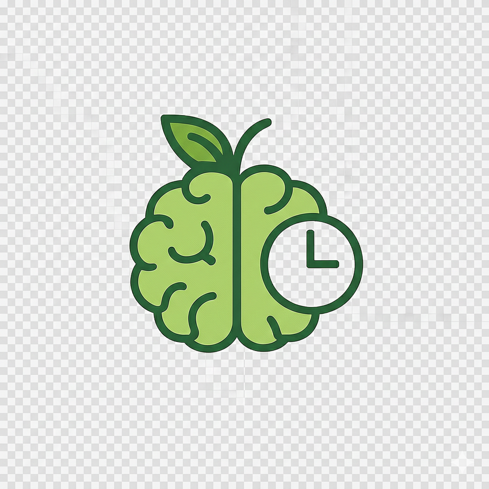

<div align="center">
  

# RotNot

</div>

## About

RotNot is a smart food-rescue platform designed to stop edible food from becoming waste. We connect surplus-heavy businesses and everyday households with nearby food banks and communities, turning “future trash” into a valuable shared resource. By bridging the gap between kitchens with excess food and people who need it, RotNot helps move food from shelves to plates before it has a chance to rot.

For businesses, RotNot automates the donation pipeline, making it simple to track surplus, schedule pickups, and earn Green Credits instead of paying disposal costs. For households, the platform offers smart food-shelf tracking and AI-powered recipe generation, helping families use what they already have and reduce everyday food waste from the root.

Our vision is a social circular economy where food is continuously shared, not discarded. By creating permanent food-sharing corridors between producers, stores, homes, and food banks. RotNot transforms waste into community impact designing food waste out of the system entirely.

## Features

- **Smart Food Detection** - Camera-based food identification, storing and expiry tracking
- **Detailed Food Shelf Tracking** - Comprehensive inventory management with shelf organization, quantity monitoring, and consumption patterns
- **Smart Recipe Suggestion** - AI based recipe suggestion
- **Food Bank Locator** - Find nearby food banks on an interactive map
- **Expiry Alerts** - Push notifications for items nearing expiration
- **Easy Donations** - Seamless food donation management
- **Platform-Specific Features** - Businesses And Households

## Tech Stack

### Frontend (Mobile)

- Flutter & Dart
- Firebase Auth
- Flutter Map with OpenStreetMap
- Camera & Image Picker
- Local Notifications

### Backend (API)

- Node.js & Express
- TypeScript
- MongoDB with Mongoose
- Firebase Admin SDK
- Automated cron jobs

### AI/ML

- Python
- YOLOv8 for food detection
- HuggingFace(meta-llama/Llama-3.1-70B-Instruct)

## Project Structure

```
RotNot/
├── frontend/rotnot/    # Flutter mobile app
├── backend/            # Node.js API server
└── scripts/            # Python ML scripts
```

## License

MIT License

---

<div align="center">
  Built with ❤️ and Passion 
</div>
